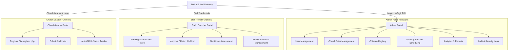

# DivineShield (MAINPI Cloud System)

DivineShield is a nationwide, secure, role-based cloud system designed for **MAINPI (Minister's Association Integrated Nutrition Program Inc.)**. The platform coordinates feeding programs for children in underserved communities across the Philippines.

DivineShield connects MAINPI Administrators, Staff/Encoders, and local Church Leaders to streamline child registration, automate nutritional assessments, monitor attendance, and generate system analytics.

---

## 🚀 System Architecture & Role Portals

DivineShield consists of three distinct portals, each with restricted access levels and tailored functions:



---

## 👥 Role Specifications & User Flows

### 1. Admin Portal

> **"Sila ang may full control, nakikita nila ang lahat, at maaari nilang baguhin ang lahat."**

- **Access Flow:** Credentials Login (Username + Password) ➔ 4-digit PIN Verification ➔ Full System Access.
- **Modules:**
  - **User Management:** Create, edit, delete, activate, or deactivate accounts for Admins, Staff, and Church Leaders.
  - **Church Sites:** Manage registered church sites and view program participation.
  - **Children Registry:** View the unified roster of all qualified beneficiaries.
  - **Nutritional Monitoring:** Analyze system-wide nutritional progress.
  - **Feeding Programs:** Schedule and manage nationwide feeding sessions.
  - **Analytics:** Dashboard metrics including total children, qualified vs. disqualified, and regional graphs.
  - **Reports:** Export and print system data (PDF/CSV support).
  - **Notifications:** Broadcast announcements to staff or church leaders.
  - **Audit Logs:** System-wide security logs detailing _who_, _when_, and _what_ was done.
  - **Security:** Monitor session activity and track failed login attempts.
  - **Settings:** Manage system-wide configurations.

---

### 2. Staff / Encoder Portal

> **"Sila ang nagve-verify at nagdedecide kung qualified ba talaga ang bata."**

- **Access Flow:** Staff Login ➔ Dashboard ➔ Action Center.
- **Modules:**
  - **Submission Review:** View all submissions sent by church leaders.
  - **Status Lifecycle:** Every submission starts as `Pending`.
  - **Verification Action:**
    - **Approve (Qualified):** System automatically registers the child into the permanent Children Registry database table.
    - **Reject (Disqualified):** Input a reason/note to communicate back to the church leader.
  - **Children Records:** View and check overall enrolled child data.
  - **Nutritional Monitoring:** Track BMI progression and record monthly growth metrics.
  - **Attendance:** Manage feeding session presence logs.
  - **RFID Interface:** Integration for RFID-based attendance hardware.

---

### 3. Church Leader Portal

> **"Sila yung mag-sa-submit ng mga names and information ng mga bata."**

- **Access Flow:** Registration (`register.php`) ➔ Admin Activation Approval ➔ Login ➔ Submit Child Info.
- **Modules:**
  - **Church Site Registration:** Provide church information, personal profile details, and account credentials.
  - **Account Activation:** Access is blocked until an Administrator manually activates the account.
  - **Submit Child Info:** Enter child details including:
    - Name, age, guardian details, and location.
    - Height (cm) & weight (kg).
  - **Auto-BMI Assessment:** System automatically calculates BMI and suggests qualification status (Qualified/Disqualified) for the child.
  - **My Submissions:** Track whether submissions are `Pending`, `Approved (Qualified)`, or `Rejected (Disqualified)`.
  - _Note: Once submitted, records are read-only for church leaders. They cannot modify or approve submissions._

---

## 🔒 Security & Cloud Infrastructure

- **AES-256 Encryption:** Protects sensitive child data both in transit and at rest.
- **Role-Based Access Control (RBAC):** Restricts interface access according to account permissions.
- **Multi-Factor Authentication (MFA):** Secondary PIN protection for admin accounts.
- **Audit Trails:** Secure logging of all database mutations.
- **Threat Detection:** System alerts for brute-force logins and session hijacking.
- **Google Cloud Platform:** Configured for high-performance hosting, Cloud SQL database storage, and BigQuery/Looker analytical tracking.

---

## 📂 Project Structure

```text
Divineshield/
├── assets/
│   ├── css/
│   │   └── style.css            # Stylesheets for layouts, grids, and themes
│   └── images/
│       ├── mainpi-logo.png      # Official MAINPI Logo
│       └── ...                  # System visual assets and placeholders
├── index.php                    # Public landing page and gatekeeper links
├── admin.png                    # Admin specs reference
├── staff.png                    # Staff/Encoder specs reference
├── churchleader.png             # Church Leader specs reference
└── README.md                    # System documentation
```

---

_Developed for MAINPI (Minister's Association Integrated Nutrition Program Inc.)_
